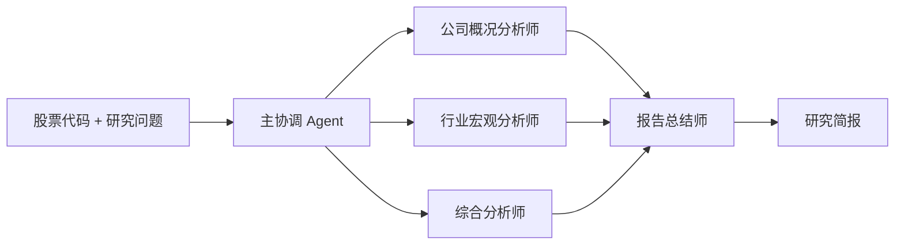

# ResearchPilot

> 把资料搜集交给一支 AI 研究团队。

ResearchPilot 是一个面向 A 股研究的多 Agent 投研助手。用户输入股票代码和研究问题后，主协调 Agent 会准备 Tushare 结构化数据和 Tavily 公开资料，并行调度三个专业分析 Agent，最后由报告总结 Agent 生成研究简报。

本项目参考 [InvestPilot](https://github.com/junglego3/InvestPilot) 的角色分工和“结构化数据 + 联网搜索 + 专业报告”工作流，代码为独立实现，不复制其源码、提示词或品牌。

## 架构



### 主协调 Agent

- 校验 A 股代码和研究问题
- 调用 Tushare 获取行情、估值与财务指标
- 调用 Tavily 搜索公司、行业、政策和新闻资料
- 并行启动三个分析 Agent
- 把三个子报告交给报告总结师

### 公司概况分析师

整理公司基本信息、主营业务、商业模式、收入结构、核心产品、客户类型和发展里程碑。

### 行业宏观分析师

整理行业生命周期、竞争格局、产业链、政策监管、宏观变量、结构性机会和外部约束。

### 综合分析师

结合 Tushare 和代码计算结果，描述基本面、估值状态、价格趋势、量能、财务健康和数据缺口。

### 报告总结师

只整合三个子 Agent 的材料，生成执行摘要、关键要点、公司概况、行业与宏观、财务估值与市场、分歧、风险、下一步研究问题和来源索引。

## 数据与模型

- Tushare：A 股行情、估值、财务指标
- Tavily：公司官网、公告新闻、行业、政策和宏观资料搜索
- DeepSeek：三个分析子 Agent 与一个报告总结 Agent
- D1：按登录用户保存加密后的 DeepSeek/Tavily API Key

每次完整研究包含 4 次模型调用：三个分析 Agent 并行，完成后调用一次报告总结 Agent。

## 产品边界

- 当前只支持单只 A 股
- 不连接券商，不自动下单
- 不输出评级、置信度、目标价、仓位或收益承诺
- AI 输出用于节省资料搜集与初步整理时间，最终判断由用户完成
- 网页搜索结果是研究线索，重要事实应回到原始来源复核

## 本地运行

要求 Node.js 22.13 或更高版本。

```bash
npm install
npm run dev
```

验证：

```bash
npm test
npm run lint
```

本地环境变量示例见 `.env.example`。不要提交真实凭据。

## 文档

- [系统架构](docs/ARCHITECTURE.md)
- [Agent 输出契约](docs/AGENT_CONTRACTS.md)

## License

[MIT](LICENSE)

## 免责声明

本项目仅用于研究与教育。任何 AI 输出都不构成投资建议、交易建议或收益承诺。
