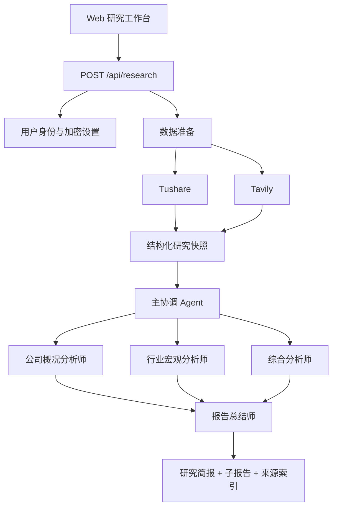

# ResearchPilot 系统架构

## 1. 运行流程

主协调器由服务端代码实现，负责确定性的输入校验、数据准备、并发、错误处理和结果组装。四个子 Agent 由 DeepSeek 独立模型调用实现。

## 2. 数据准备

### Tushare

当前调用：

- `stock_basic`：公司名称、行业、市场和上市日期
- `daily`：近 120 日收盘价、涨跌、成交量和成交额
- `daily_basic`：PE、PB、PS、股息率、市值和换手率
- `fina_indicator`：ROE、毛利率、净利率、资产负债率、经营现金流和季度增长

代码计算区间收益、最大回撤、年化波动和量能变化。权限不足的可选接口以信息缺口返回。

### Tavily

每次研究执行三类基础搜索：

1. 公司官网、主营业务、收入结构和最新年报
2. 公司公告、重大事项和相关新闻
3. 行业竞争格局、政策和趋势

搜索结果去重后最多保留 10 条，每条带标题、URL、摘要和来源编号。

## 3. Agent 编排

三个分析 Agent 使用 `Promise.all` 并行执行。它们接收相同的公司身份和用户问题，但拥有不同的数据范围和系统角色。报告总结师只有在三个子报告全部完成后运行。

所有 Agent 必须：

- 仅引用输入中的 `TUSHARE-*` 或 `WEB-*` 来源编号
- 区分事实、分析和资料缺口
- 不展示隐藏思维链
- 不输出评级、置信度或交易建议
- 返回固定 JSON 结构

## 4. 安全

- Tushare Token 为部署级 Secret，不进入浏览器和 Git。
- DeepSeek 与 Tavily Key 使用 AES-GCM 加密后按用户保存到 D1。
- 加密主密钥独立存放在部署 Secret 中。
- 设置 API 只返回是否已配置，不返回明文凭据。
- 外部网页内容仅作为不可信研究输入，不得覆盖系统规则。

## 5. 当前限制

- API 请求为同步长任务，尚未使用队列或 SSE 实时事件。
- 仅支持 A 股标准代码。
- 没有自动保存研究历史；用户可以下载 Markdown。
- 未解析公告 PDF 全文，主要依赖 Tavily 摘要与 Tushare 数据。
- 暂不生成 PDF，避免把排版优先级放在资料质量之前。

## 6. 后续路线

1. 增加研究任务持久化与历史报告。
2. 增加 SSE，展示真实 Agent 阶段状态。
3. 接入交易所公告全文与公司年报解析。
4. 增加 Markdown 到 PDF 的确定性导出。
5. 增加港股和美股数据适配。
